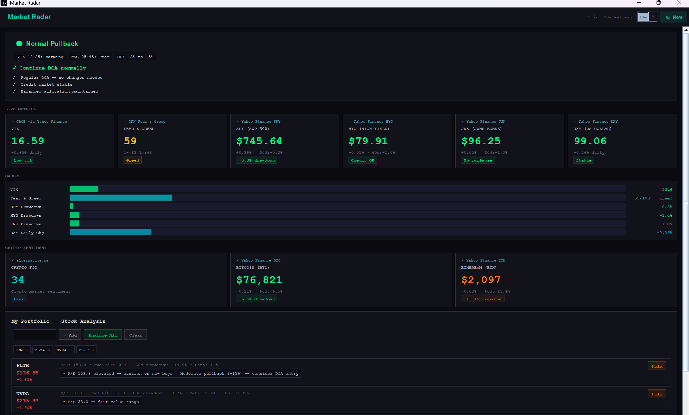

# Market Radar — Know When to Buy, Hold, or Defend

A desktop application that monitors live market data and automatically classifies the current market into one of **5 scenarios** — each with a clear investment action.

Stop guessing. Let the data tell you what to do.

---

## What It Does

| Scenario | Condition | Action |
|----------|-----------|--------|
| **Normal Pullback** | VIX 18–25, F&G 25–45, SPY -3% to -5% | Continue DCA normally |
| **Fear Pullback** | VIX 25–30, F&G <25, SPY -7% to -10% | Add in 3 tranches (30/30/40) |
| **Extreme Fear** | VIX >35, F&G 0–15, AAII bearish >31% | Contrarian buy — core assets |
| **Systemic Risk** | VIX high + HYG/JNK crashing + USD surging | Defend: cut leverage, hold cash |
| **Excessive Greed** | VIX <15, F&G >75, index ATH + breadth deteriorating | Reduce aggression, trim winners |

## Live Metrics Monitored

- **VIX** — CBOE Volatility Index (market fear gauge)
- **CNN Fear & Greed** — composite sentiment (0–100)
- **S&P 500 (SPY)** — drawdown from 60-day high
- **HYG / JNK** — high-yield bonds (credit stress detector)
- **DXY** — US Dollar Index (panic flight-to-safety signal)
- **BTC / ETH** — crypto prices + Crypto Fear & Greed

## Portfolio Analysis

Add your stock tickers and get **context-aware advice** based on the current market scenario:

- P/E and Forward P/E valuation
- 60-day drawdown from high
- Beta and dividend yield
- Advice that changes with market conditions:
  - *"P/E 37.4 — fair value range. Near 60d high in greed market — consider partial profits"*
  - *"Down 22% — strong DCA candidate in this fear environment"*
  - *"Systemic risk active — reduce if leveraged"*

Portfolio syncs across all your devices.

## Features

- ✓ Real-time data (auto-refresh every 10 minutes, configurable 30s–1hr)
- ✓ Clickable source links to verify data
- ✓ Tooltips explaining what each metric range means
- ✓ Cross-platform: Windows, macOS, Linux
- ✓ No account needed — just a license key
- ✓ Lightweight (~330KB)

## Requirements

- Java 11 or higher installed
- Internet connection

## How to Run

Double-click `market-radar.jar` on any platform (Windows, macOS, Linux).

## Get It

**Price: $20 (one-time purchase)**

[→ Buy Market Radar](https://buy.stripe.com/fZucN485R8PsfK66BIafS00)

After payment you'll receive a license key and download link instantly. No subscription, no recurring fees.

## Architecture

Read the full technical deep-dive: [From Code to CDN: Building a Personal Market Radar](https://www.zhangxn.com/blog/market-radar-stock-analysis/)

---

*Built by [Mike Zhang](https://www.zhangxn.com)*
